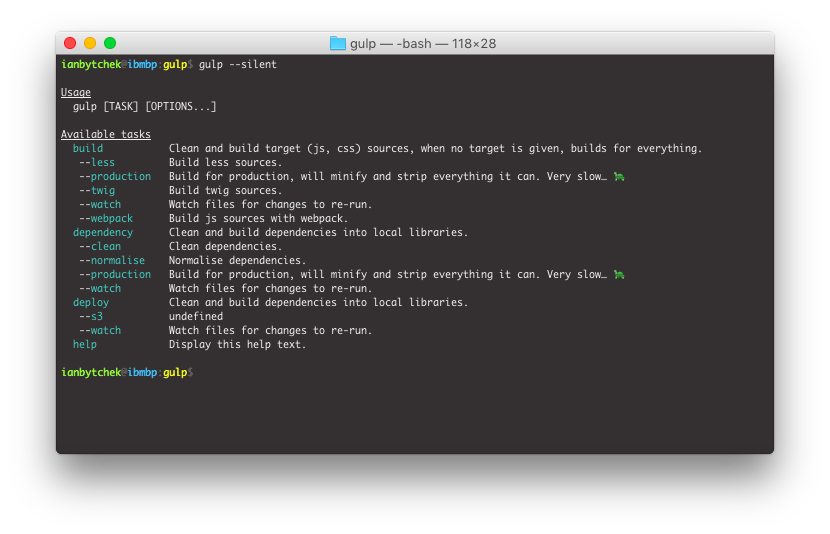

# Guild

Guild is a gulp configuration framework for common build-test-deploy tasks. Instead of copy-pasting repeated unmaintainable tasks from project to project, with guild, they can be `required()` as a single npm module and used with a simple configuration.

<div align="center"></div>

The above is the result of the following configuration, which goes into your guilpfile. It adds the specified tasks and can be safely used with your own tasks, given there are no naming conflicts.

```js

// Keep path configuration and other complex / reusable stuff separately.

var configuration = require('./configuration/path');
var guild = require('@ianbytchek/guild');
var gulp = require('gulp');

guild(gulp, {
    dependency: {
        normalise: {
            "jquery": 'bower_components/jquery/dist/jquery.min.js',
            "normalize": 'bower_components/normalize.css/normalize.css'
        }
    },
    build: {
        webpack: require('./configuration/webpack'),
        less: true,
        twig: true
    },
    deployment: {
        s3: [
            'favicon.icon',
            'html/*'
        ]
    }
    path: configuration
});
```

## Setup

Install using `npm install @ianbytchek/guild` or add it to `package.json`.

```json
"dependencies": {
    "guild": "@ianbytchek/guild"
}
```

## Configuration

- [Dependency](#dependency)
    - [Normalise](#normalise)
- [Build](#build)
    - [Less](#less)
    - [Twig](#twig)
    - [Webpack](#webpack)
- [Test](#) (WIP)
- [Deployment](#deployment)
    - [S3](#s3)

### Path

`Path` object holds default project paths if configuration contains relative paths or assumes the use of default locations. It can be created with `require('@ianbytchek/guild').PathConfiguration('/absolute/project/path'))`.

### Dependency

Prepares project dependencies, which most often require little touches to go into the code.

#### Normalise

Normalises dependencies, typical use case is to minify them, strip comments, and move to a single location, like `library/js` or `library/css` folder.

```js
normalise: {
    "foo": path.join(configuration.path.dependency, 'bower/foo.js')
    "bar": {
        source: path.join(configuration.path.dependency, 'bower/bar/bar.css'),
        destination: path.join(configuration.path.library, 'css/bar.css'),
        pipeline: ['default', 'minify', 'uncomment', require('gulp-autoprefixer')]
    }
}
```

Normalise will automatically determine if the dependency is `js` or `css` and will send it through default streams, so you can simply tell it the where the source is, the key will be used to name the final file.

- `source` – path, array of paths, required.
- `destination` – path, array of paths, optional, outputs everything into `configuration.path.library`, will raise exception if not specified and multiple sources are used or when library path is not defined.
- `plugins` – array of custom streams (when constants) or a function returning an array of actual streams. You can provide standard guild pipelines as strings, `default` includes them all.

### Build

Builds project files, typically involves building js, css, html products and packaging them up with webpack.

#### Less

Compiles less sources, simplified form allows specifying only `true` or less source path.

```js
less: true,
less: 'less/source/path'
less: {
    source: path.join(configuration.source, 'less'),
    destination: path.join(configuration.product, 'css')
}
```

Full form assumes a single configuration object or an array of them.

- `source` - path, array of paths.
- `destination` - path, array of paths.
- `plugins` – same as for normalise task.

#### Webpack

Compiles webpack sources.

```js
webpack: {
    source: path.join(configuration.source, 'less'),
    destination: path.join(configuration.product, 'css'),
    configuration: require('…')
}
```

- `source` - path.
- `destination` - path.
- `configuration` – standard webpack configuration.
- `plugins` – same as for normalise task.

### Deployment

#### S3

Accepts the following syntax.

```js

// Plain list of targets to upload. Passes parameters directly to awspublish.

s3: [
    'js',
    'css'
]

// List of targets with specifying base directory. The first case is very typical when
// we want to upload something to the root and something not, it will copy contents of
// `html` into the root, and everything else in `css` and `js`.

s3: [
    {path: 'html/*', base: 'html'},
    {path: 'css'},
    {path: 'js'}
]

// Full syntax allowing to specify extra s3 configuration. Obvious to state that sensitive
// parameters like access and secret keys and bucket name shouldn't be stored in open.

s3: [
    {
        target: path.join(configuration.product, 'js/**/*'),
        bucket: 'foo'
    },
    {
        target: path.join(configuration.product, 'css/**/*'),
        bucket: 'bar',
        accessKey: '…',
        secretKey: '…',
        region: '…',
    }
]
```

- `bucket` – you can use this as an alias and specify `--bucket-foo` via cli options to provide the real bucket name.

## Similar projects

There are a few similar projects, I haven't seen a single compiled a list anywhere, so if you know something cool and fast-growing or already grown, I'd appreciate you adding it below.

- https://github.com/vigetlabs/gulp-starter
